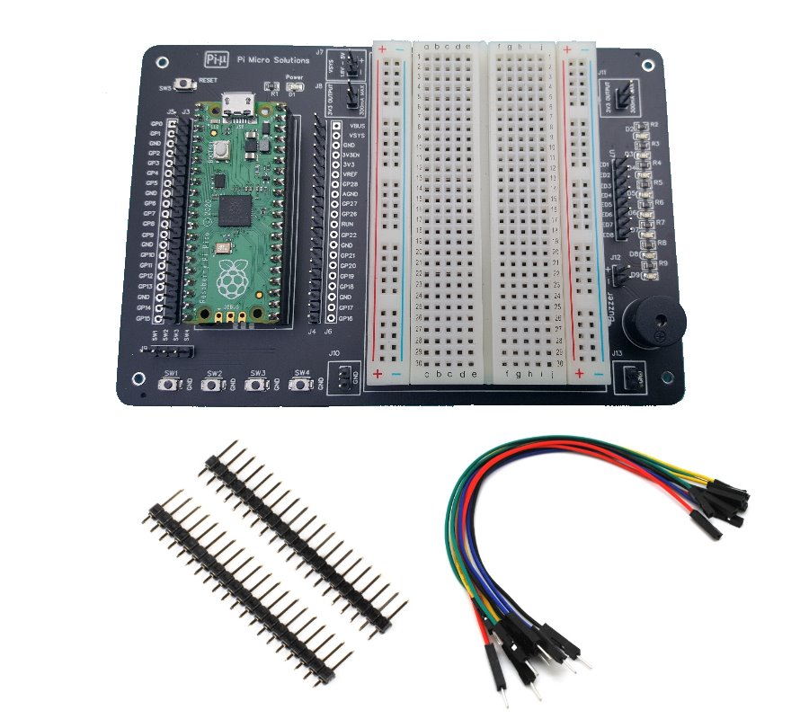

# Raspberry Pi Pico Development Board V1
The Raspberry Pi Pico Development Board V1 makes developing projects for the Pico an easy task with the onboard LED's, Switches, Buzzer and 400 point half sized breadboard.The 20 Pin headers on each side of the Pico provide connections to all available pins of the Pico board, also provided are 3.3V,GND and VSYS connection points.

The board also incorporates a reset button for the Pico, this avoids pulling out the USB connector and re-inserting when you need to upload a UF2 file. Just hold down the bootsel button and press reset button.

  

Features
---
* Reset button
* Power LED
* 4 X Push Buttons
* 8 X LED's for connecting to GPIO pins
* 3.3V - 5V Buzzer
* 2 X 20 Pin Male Headers
* 2 X 20 PCB Solder Connections
* Raspberry Pi Pico Pin Identification Legends on the board
* 456 Point Breadboard, 2.54" Pitch
* Size 133mm X 90mm

Contents
---
* Raspberry Pi Pico Development Board V1
* Raspberry Pi Pico (Unsoldered Headers)
* 2 X 20 Pin Male Headers
* 10 X Male-Female Jumper Cables

Purchasing
---
* Raspberry Pi Pico Development Board V1 (https://www.pimicrosolutions.co.uk/raspberry-pi-pico-development-kit)

Running Example Programs
---
* Plug the Raspberry Pi Pico into the headers of the Development board
* Use the supplied Jumper wires to connect the LED's and Switches for each example program

